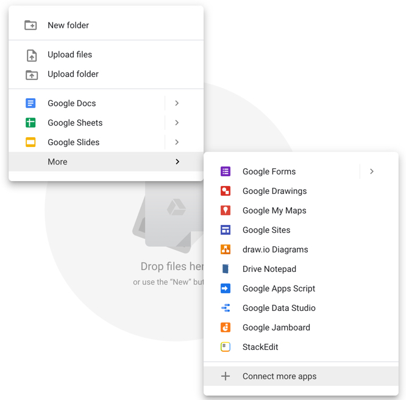
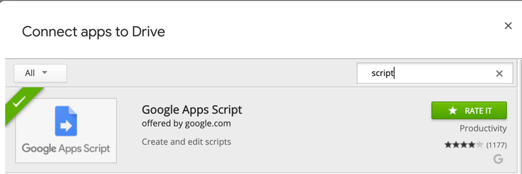
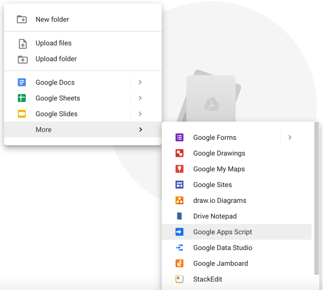
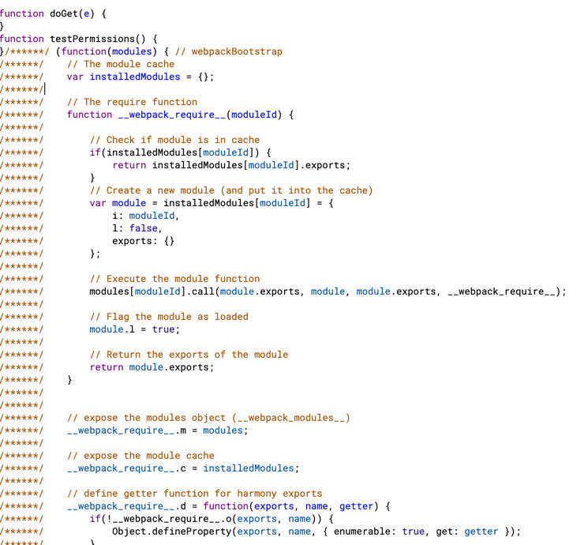
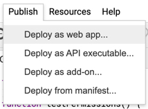
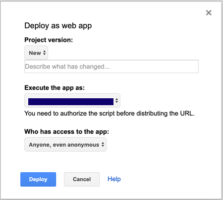
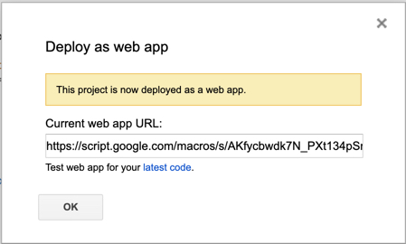
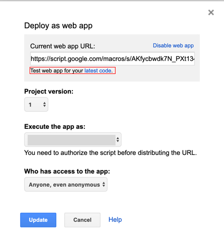

# Translation api endpoint

This google script creates an api endpoint to translate text.

## Getting set up

1. Apps script management

You'll need to install a node module globally, which will allow you to manage your google scripts locally

```
npm install -g @google/clasp
```

and follow the instuctions on https://www.npmjs.com/package/@google/clasp, you'll need to authenticate your local enviroment with:
```
clasp login
```

2. Setup remote so that you can compile and push

  - 2.1 log into google drive in a browser
  - 2.2 create a folder in you google drive (i tend to use `scripts`) folder in the root
  - 2.3 right click in the folder and click connect more apps



  - 2.4 search for scripts in the dialog and connect it



  - 2.5 create a script file by right clicking and selecting scripts from the box



  - 2.6 give your newly created script a name and save it
  - 2.7 once you've saved it go to `File -> Project properties`


  - 2.8 go back to your editor and rename / copy [./.clasp.sample.json](./.clasp.sample.json) to `.clasp.json`
  - 2.9 from script properties grab the script ID and place it in the new file `.clasp.json`

```json
{"scriptId":"yourScriptID"}
```


3. Pushing / Deploying

  - 3.1 In the current directory run `npm i` if you haven't already
  - 3.2 Adjust [appsscript.json](./appsscript.json) to your settings
  - 3.3 Run npm run sync
  - 3.4 In your browser refresh the script editor (ctrl + r) doesn't work as its a google shortcut for run

You should see a bunch of webpack output



  - 3.5 In the menu go to `Publish -> Deploy as WebApp`



  - 3.6 Have the script execute as yourself and allow `Anyone, even anonymous` under who has access



  - 3.9 Once you click deploy it will run the deployment and return a url to you



  - *3.10 Copy the Url and keep it handy*, to test if its up open the lint in another browser and you should see a json response

  - 3.11 If you run into permissions select the testPermissions funciton in the dropdown below the menu and run it


  - 3.12 You'll need to publish every once in a while, in the Publish Dialog there is also a place with the link to always test your latest code

